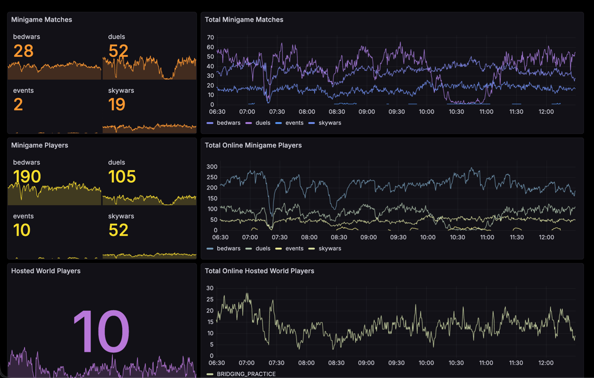
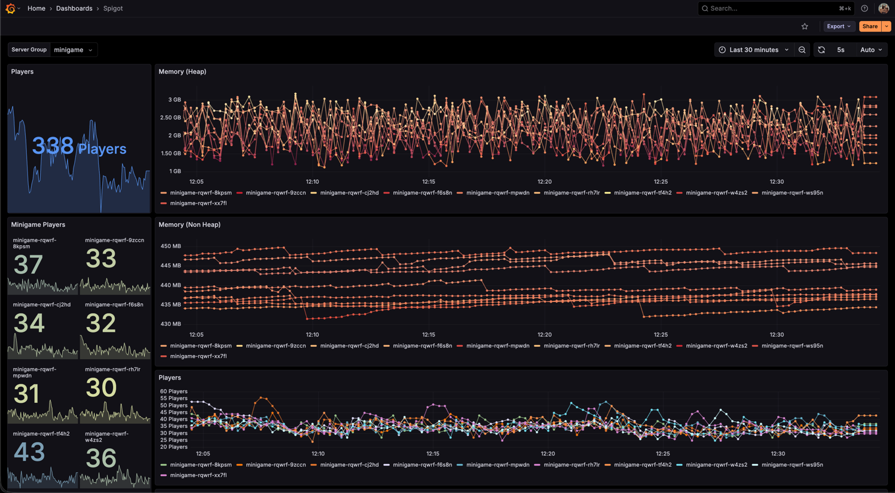

# Minigames
ArchMC's minigame systems & implementation monorepo.

## Structure:
- `services`: contain the microservice controllers that power & orchestrate our minigames
- `minigames`, `microgames`, `persistentgames`: implementations of games
- `shared`, `versioned`: common functionality
- `game`: core plugin powering our game servers

## Why:
Additional common libraries and minigame implementations are kept closed-source. However, this will serve as the new primary repo for core minigame systems, allowing the public to see how ArchMC's minigame infrastructure works.

## How It Works:
- Minigames are spread across multiple game servers. 
- Any minigame can start on any minigame server, granted it has the plugin enabled. A queue system is used to allocate requested games to their respective game servers, and other criteria such as server version, drain state, persistent world support, etc. are used to sort, filter, and decide on a game server.
  - Once a game is allocated, a new world is generated with a unique identifier based on an in-memory template of the arena.
  - Players are routed, and once all players are logged onto the server, game systems start.
- A singleton microservice application is used as the single source of truth for all data being fed into and out of game and lobby servers.
- Redis based RPC is used for the majority of cross-service communications.
- Performance is observed through Grafana:

